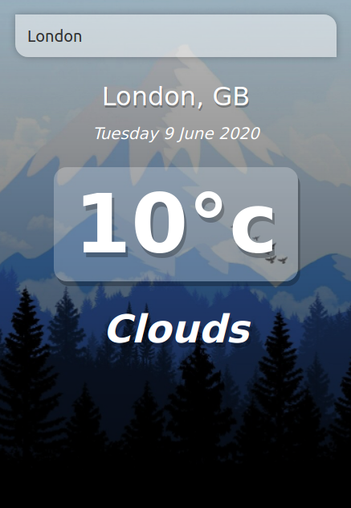

[](https://app.netlify.com/sites/batavinash-vue-weather/deploys)

# [vue-weather](https://batavinash-vue-weather.netlify.app)

  

## Project setup
```
npm install
```

### Compiles and hot-reloads for development
```
npm run serve
```

### Compiles and minifies for production
```
npm run build
```

### Lints and fixes files
```
npm run lint
```
